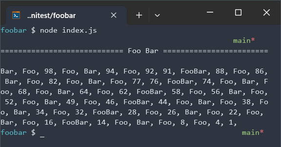
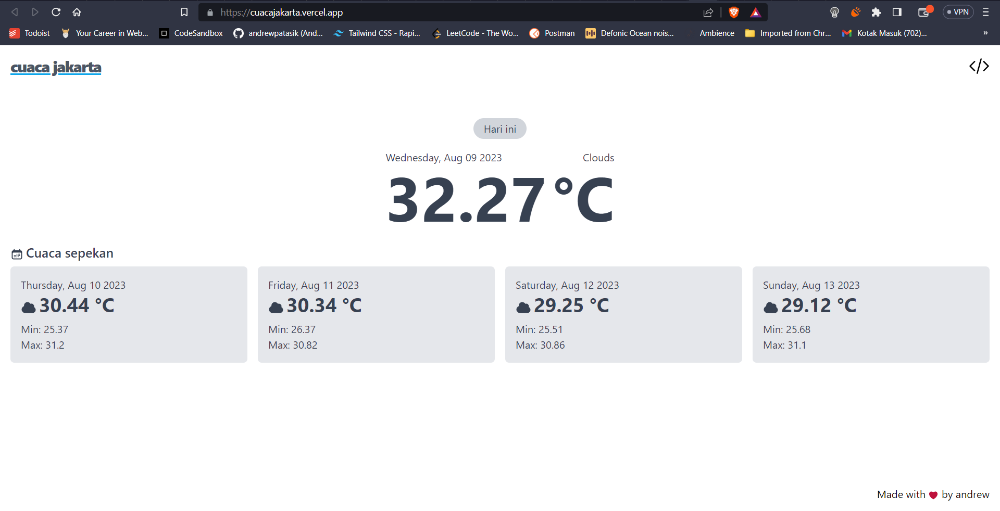

# Mini Test

### Foo Bar
#### How to Execute:
1. Open terminal
2. Navigate to <code>index.js</code> directory
3. Execute node <code>index.js</code>

#### Screenshot

---

### Cuaca Jakarta
#### How to Run Locally:
1. Navigate to <code>/cuacajakarta</code> directory
2. Run <code>yarn</code>
3. Run <code>yarn dev</code>

#### Live Web:
[cuacajakarta.vercel.app](https://cuacajakarta.vercel.app/)

#### Screenshot

